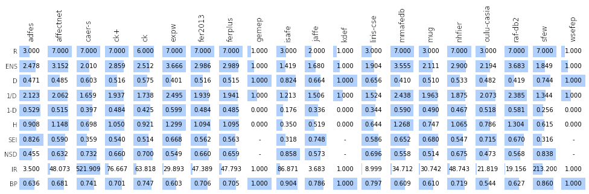
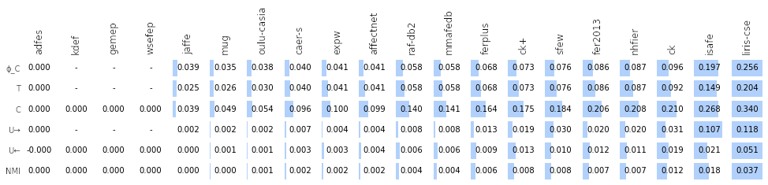
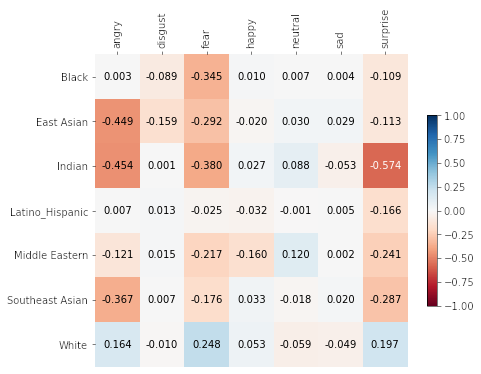

# Dataset demographic bias metrics

This package implements several metrics for dataset demographic bias. The 
metrics are organized as follows:

* Representational bias metrics (`dataset_bias_metrics.representational`)
* Stereotypical bias metrics at the global level (`dataset_bias_metrics.stereotypical`)
* Stereotypical bias metrics at the local level (`dataset_bias_metrics.local_stereotypical`)
* Some visualization tools (`dataset_bias_metrics.visualization`)

## Installation

Binary installers for the latest released version are available at the [Python Package Index (PyPI)](https://pypi.org/project/dataset_bias_metrics).

`pip install dataset-bias-metrics`

## Usage

### Including the libraries


```python
import pandas as pd
import os

import dataset_bias_metrics as dbm
```

### Loading example datasets

The .csv files available in `example_data` correspond to the datasets analyzed in the paper. Only the demographic data with no identifying information is provided, and the rows are scrambled to avoid the identification of specific samples.


```python
datasets = {}
for filename in os.listdir('example_data'):
    if filename.endswith(".csv"):
        ds = pd.read_csv(os.path.join('example_data', filename))
        datasets[filename.split('.')[0]] = ds
    
display(datasets['raf-db2'])
```


<div>
<style scoped>
    .dataframe tbody tr th:only-of-type {
        vertical-align: middle;
    }

    .dataframe tbody tr th {
        vertical-align: top;
    }

    .dataframe thead th {
        text-align: right;
    }
</style>
<table border="1" class="dataframe">
  <thead>
    <tr style="text-align: right;">
      <th></th>
      <th>age</th>
      <th>race</th>
      <th>gender</th>
      <th>label</th>
    </tr>
  </thead>
  <tbody>
    <tr>
      <th>0</th>
      <td>20-29</td>
      <td>Indian</td>
      <td>Male</td>
      <td>disgust</td>
    </tr>
    <tr>
      <th>1</th>
      <td>20-29</td>
      <td>White</td>
      <td>Male</td>
      <td>disgust</td>
    </tr>
    <tr>
      <th>2</th>
      <td>30-39</td>
      <td>White</td>
      <td>Male</td>
      <td>angry</td>
    </tr>
    <tr>
      <th>3</th>
      <td>60-69</td>
      <td>Southeast Asian</td>
      <td>Female</td>
      <td>happy</td>
    </tr>
    <tr>
      <th>4</th>
      <td>40-49</td>
      <td>East Asian</td>
      <td>Male</td>
      <td>neutral</td>
    </tr>
    <tr>
      <th>...</th>
      <td>...</td>
      <td>...</td>
      <td>...</td>
      <td>...</td>
    </tr>
    <tr>
      <th>15121</th>
      <td>30-39</td>
      <td>White</td>
      <td>Male</td>
      <td>sad</td>
    </tr>
    <tr>
      <th>15122</th>
      <td>30-39</td>
      <td>East Asian</td>
      <td>Male</td>
      <td>happy</td>
    </tr>
    <tr>
      <th>15123</th>
      <td>20-29</td>
      <td>Black</td>
      <td>Male</td>
      <td>fear</td>
    </tr>
    <tr>
      <th>15124</th>
      <td>30-39</td>
      <td>White</td>
      <td>Female</td>
      <td>happy</td>
    </tr>
    <tr>
      <th>15125</th>
      <td>20-29</td>
      <td>White</td>
      <td>Female</td>
      <td>neutral</td>
    </tr>
  </tbody>
</table>
<p>15126 rows × 4 columns</p>
</div>


### Representational bias

The following is an example of the application of the representational bias metrics:


```python
# Application of a single metric
dbm.representational.ens(datasets['adfes'], 'race')
```


    2.478206948646503


```python
# It also supports combined components
dbm.representational.ens(datasets['adfes'], ['age', 'race'])
```


    3.0404964294246533


```python
# Comparative analysis across datasets, with visualization
component = 'race'
repbias = pd.DataFrame(0, 
                       index=datasets.keys(), 
                       columns=dbm.representational.metrics.keys())

for dsname, ds in datasets.items():
    for metricname, m in dbm.representational.metrics.items():
        repbias.loc[dsname, metricname] = m(ds, component)

display(f'{component.capitalize()} component')
dbm.visualization.plotTable(repbias.T, normalizeAxis=1, sort=None)
```


    'Race component'


    

    


### Stereotypical bias (global)

The following is an example of the application of the global stereotypical bias metrics:


```python
# Application of a single metric
dbm.stereotypical.cramersv(datasets['expw'], 'race', 'label')
```


    0.04104288518527493


```python
# Comparative analysis across datasets, with visualization

c1, c2 = ('race', 'label')
stereobias = pd.DataFrame(0, 
                          index=datasets.keys(), 
                          columns=dbm.stereotypical.metrics.keys())

for dsname, ds in datasets.items():
    for metricname, m in dbm.stereotypical.metrics.items():
        stereobias.loc[dsname, metricname] = m(ds, c1, c2)

display(f'{c1.capitalize()}-{c2.capitalize()} components')
dbm.visualization.plotTable(stereobias.T, normalizeAxis=1)
```


    'Race-Label components'


    

    


### Stereotypical bias (local)

The following is an example of the application of the local stereotypical bias metrics:


```python
# Single metric application with visualization
ds = datasets['expw']
c1, c2 = ('race', 'label')

matrix = dbm.local_stereotypical.duchersz(ds, c1, c2)

display(f'{c1.capitalize()}-{c2.capitalize()} components, {metricname}')
dbm.visualization.plotMatrix(matrix)
```


    'Race-Label components, NMI'


    

    

